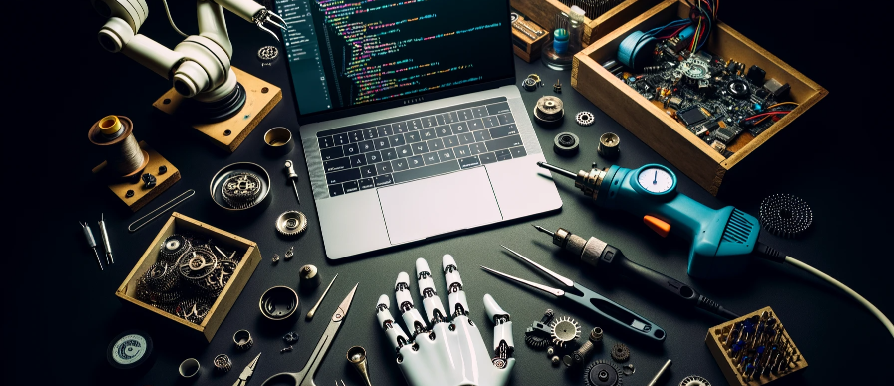

  

# IntroductionToRobotics (2023 - 2024)

Welcome to the "IntroductionToRobotics" repository! This repository showcases my journey and work in the fascinating world of robotics. It's designed to give a brief insight into my projects, my thought process, and the solutions I implemented.

# Description
Robotics is the intersection of technology, engineering, and creativity. The projects and tasks in this repository are a testament to the ever-evolving world of robotics and how I approached them. While this isn't a tutorial, it's a window into the vast possibilities within the domain and my personal take on them.

# Repository Contents

[Code](./code/): Samples of code used in various robotics projects.

[Media](./media/): Visuals always help! Check out some of the robots in action.

[Notes](./notes/): Personal notes and observations made during the learning process.

[Projects](./projects/): Dive deep into each project I worked on, from conceptualization to realization.

[Resources](./resources/): A collection of resources I found helpful in this journey.

### How to Navigate?

Each folder has its own specific README. If you're interested in a particular project or topic, navigate to its respective folder and follow the README there.

# For Recruiters
If you're a recruiter looking to understand my work and skills better:

Technical Proficiency: Take a look at the Code folder to view my coding skills and how I approached problem-solving.

Project Management: The Projects folder gives a step-by-step breakdown of how I managed and executed various projects.

Learning & Growth: My Notes reflect how I understand, interpret, and grow in the field of robotics.

# Contact
For any queries, collaboration opportunities, or general feedback, please reach me at

matei-alexandru.podeanu@s.unibuc.ro.
