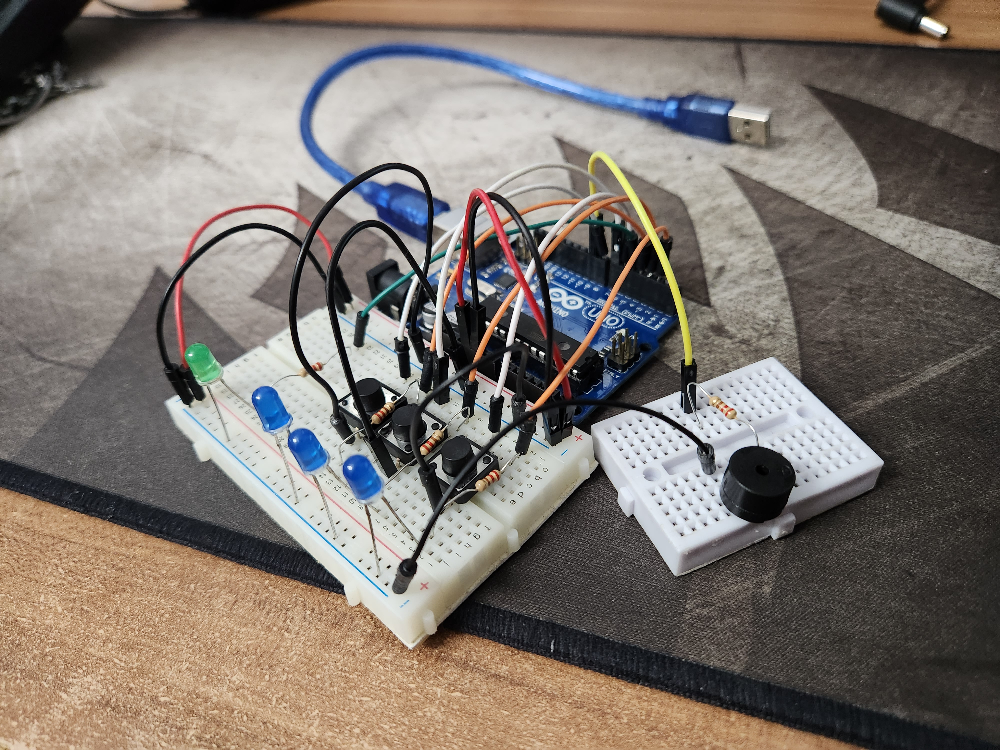

# Introducere în Robotică: Proiect Elevator Simulat
## Obiectiv:
Simularea unui sistem de lift cu trei etaje folosind un microcontroler Arduino. Sistemul trebuie să poată gestiona următoarele funcționalități: navigarea între etaje, indicarea etajului curent, interacțiunea cu butoanele și indicarea stării de funcționare a liftului.

## Descriere tehnică:
### Configurație:

Prezintă trei LED-uri, fiecare reprezentând unul dintre etajele liftului. Acestea sunt conectate la pinii Arduino specificați în array-ul floorLEDs[].

De asemenea, există un LED suplimentar, operationLED, care indică dacă liftul este în funcțiune.

Butonul pentru fiecare etaj este conectat la pinii Arduino specificați în array-ul buttonPins[].

Un buzzer este folosit pentru a indica când liftul începe să se miște și când ajunge la etajul solicitat.

  

## Funcționare:
Liftul verifică în mod continuu dacă a fost apăsat vreun buton. Dacă un buton este apăsat, etajul corespunzător este adăugat într-o coadă (floorQueue).

Când liftul nu se mișcă și există etaje în coadă, începe să se deplaseze către primul etaj din coadă. În timp ce liftul se mișcă, LED-ul de funcționare clipește și buzzerul sună.

Liftul așteaptă o anumită întârziere (startMoveDelayDuration) înainte de a începe mișcarea și apoi se deplasează către etajul solicitat. Când ajunge la etajul dorit, buzzerul sună din nou pentru a indica sosirea.

## Rezultat așteptat:

Atunci când un buton este apăsat, liftul ar trebui să se deplaseze către etajul corespunzător, iar LED-ul pentru acel etaj ar trebui să se aprindă. LED-ul de funcționare ar trebui să clipească în timp ce liftul se mișcă și să rămână aprins atunci când liftul este staționar.

## Proof that it works:

https://youtu.be/boFFY5fJr24
