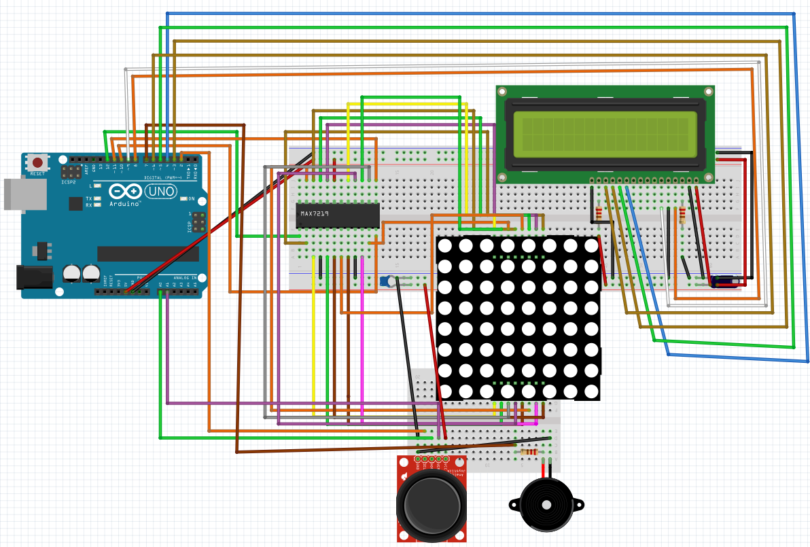

# Introducere în Robotică: Cronometru

## Obiectiv
Crearea unui joc care să se desfășoare pe matricea de 8x8. Jocul trebuie să conțină (cel puțin) elementele din lista următoare: bombe/gloanțe, pereți și un jucător. Harta trebuie să fie suficient de complexă (pereții să acopere cel puțin 50% din suprafața acesteia), iar experiența de joc trebuie să fie una fluentă și satisfăcătoare pentru utilizator.

## Descriere Tehnică

### Configurație

Componentele includ o matrice cu 8x8 led-uri, circuitul integrat MAX7219, un joystick, un buzzer, un display lcd, două condensatoare, alături de rezistorii și firele necesare. 
Funcționalitățile pentru fiecare componentă sunt următoarele:
- **Matricea**: Folosită pentru a afișa jocul în sine.
- **Display-ul lcd**: Folosit pentru afișarea meniului.
- **Buzzer**: Este folosit pentru a oferi un feedback auditiv la acțiunile jucătorului.
- **Joystick**: Este utilizat pentru a naviga meniul jocului, dar și pentru a controla acțiunile player-ului pe hartă în timpul jocului.

### Funcționare

La pornirea arduino-ului, este afișat meniul principal pe display-ul lcd. Acest meniu dispune de 3 opțiuni: Start, Highest Scores și Settings. În meniul Settings avem opțiunea de a alege unul dintre cele 3 nivele de dificultate (acest nivel va determina mărimea și complexitatea hărții afișate în timpul jocului). În opțiunea Highest Scores, putem vedea cel mai bun timp obținut de un jucător. Acest timp este salvat în EEPROM și actualizat în cazul în care un jucător a terminat jocul într-un timp mai scurt decât cel salvat. Opțiunea start pornește jocul.

Jocul constă într-un labirint ce conține două tipuri de structuri: pereți solizi (reprezentați de un led care stă în permanență aprins) și pereți care se pot sparge (reprezentați de un led care se aprinde și se stinge într-un interval foarte scurt de timp). Scopul jucătorului (reprezentat pe hartă de un led care se aprinde și se stinge la un interval puțin mai mare de timp în comparație cu pereții) este de a găsi drumul cel mai scurt spre capătul labirintului. Deoarece complexitatea jocului era limitată de dimensiunea matricei (8x8 led-uri), jocul implementează noțiunea de pov (point of view), o vedere de sus a hărții care se mută pentru a menține player-ul cât mai aproape de centrul hărții. La apăsarea joystick-ului, player-ul trimite un proiectil (reprezentat de un led care se mișcă repede pe hartă) în ultima direcție în care a fost orientat. Aceste proiectile pot sparge pereții (cu excepția celor solizi) și astfel deblochează drumuri prin labirint. În timpul jocului, display-ul lcd afișează durata de timp petrecută în labirint.

## Rezultat Așteptat

Astfel am realizat un joc distractiv și ușor de înțeles, folosindu-ne de componente simple și găsind soluții pentru limitările acestora. Jucătorii vor putea naviga prin labirint, evitând obstacolele și căutând cea mai bună cale. Scopul a fost să ofer o experiență distractivă, simplă, dar captivantă. Consider că acest joc reușește să transmită această experiență.

## Proof that it works

[Video Demonstration](https://youtu.be/_FXRRNarRLw)
