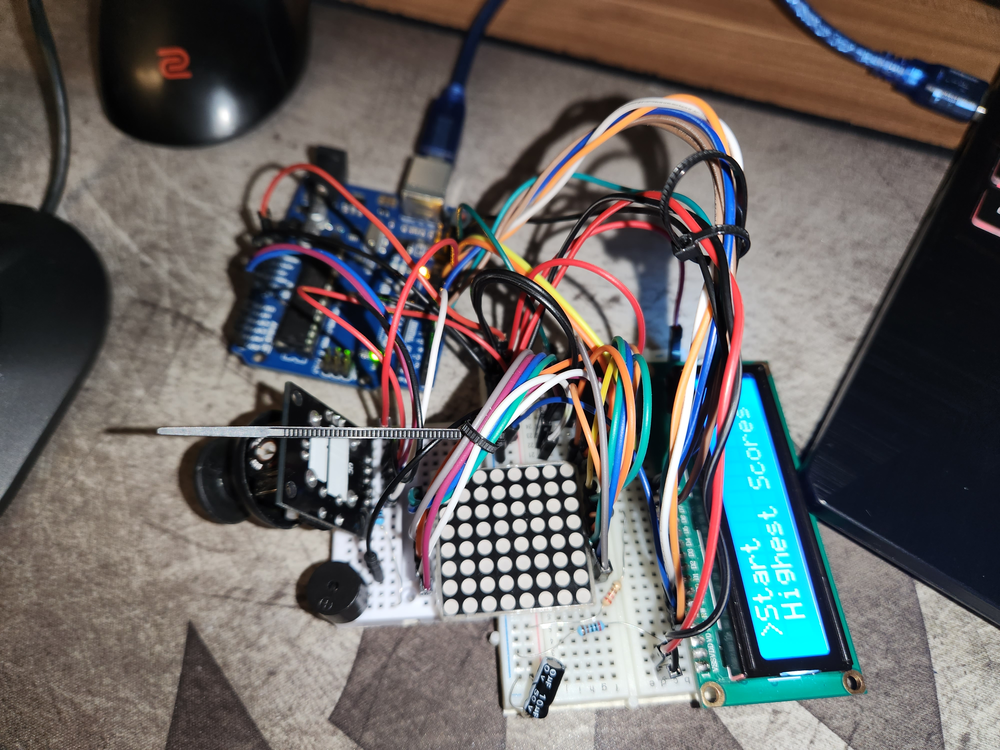

# Introducere în Robotică: Cronometru

## Obiectiv
Îmbunătățirea meniului pentru jocul din proiectul precedent. Meniul trebuie să includă setări pentru configurarea matricei, display-ului LCD, dar și o secțiune nouă care să conțină informații despre joc.

## Descriere Tehnică

### Configurație

Întrucât acesta este doar un mic update pentru proiectul anterior, configurația este în mare parte aceeași.

### Funcționare

La pornirea Arduino-ului, este afișat un mesaj de introducere pentru o perioadă de 5 secunde, după care apare meniul principal. Acest meniu dispune de 4 opțiuni: Start, Highest Scores, Settings și About. În meniul Settings avem posibilitatea de a seta luminozitatea display-ului și a matricei, dar și de a schimba nivelul de dificultate al jocului (acest nivel va determina mărimea și complexitatea hărții afișate în timpul jocului). În opțiunea Highest Scores, putem vedea cel mai bun timp obținut de un jucător. Acest timp este salvat în EEPROM și actualizat în cazul în care un jucător a terminat jocul într-un timp mai scurt decât cel salvat. Opțiunea About afișează un text care poate să fie citit prin mutarea joystick-ului. Opțiunea Start pornește jocul.

## Rezultat Așteptat

Astfel am reușit să îmbunătățim experiența de joc prin adăugarea funcțiilor de optimizare a luminozității, păstrând totuși un meniu interactiv ușor de navigat.

## Proof that it works

[Demonstrație Video](https://youtu.be/_FXRRNarRLw)
